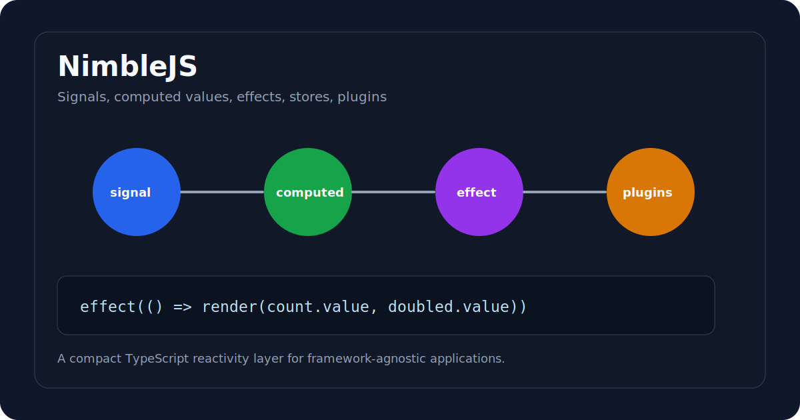

# NimbleJS

Small signals-based state management for framework-agnostic TypeScript apps.



NimbleJS is a lightweight reactivity toolkit with signals, computed values, effects, stores, and optional plugins for persistence and history. It is designed for vanilla JavaScript, Web Components, small widgets, and projects that need reactive state without adopting a full UI framework.

## What It Demonstrates

- Fine-grained dependency tracking
- Signal and computed value primitives
- Effect cleanup when dependencies change
- Store API built on top of signals
- Persistence plugin with explicit storage support
- History plugin for undo/redo behavior
- TypeScript package build with tests

## Core API

| Primitive | Purpose |
| --- | --- |
| `signal` | Holds a reactive value |
| `computed` | Derives cached values from signals |
| `effect` | Runs a function when its signal dependencies change |
| `createStore` | Groups signals into a named store |
| `persist` | Saves and hydrates store state |
| `withHistory` | Adds undo/redo state history |

## Example

```ts
import { computed, effect, signal } from "@onuracar-dev/nimblejs";

const count = signal(0);
const doubled = computed(() => count.value * 2);

const stop = effect(() => {
  console.log(`count=${count.value}, doubled=${doubled.value}`);
});

count.value = 2;
stop();
```

## Store And Persistence

```ts
import { createStore, persist } from "@onuracar-dev/nimblejs";

const store = createStore("settings", {
  theme: "dark",
  sidebarOpen: true,
});

persist(store, {
  storage: globalThis.localStorage,
});

store.state.theme.value = "light";
```

## Installation

```bash
npm install @onuracar-dev/nimblejs
```

## Development

```bash
npm install
npm test
npm run build
```

## Recent Hardening

- Added Vitest coverage for reactivity and persistence
- Made the persist plugin fail clearly outside the browser unless a storage adapter is provided
- Verified package build with declaration output

## Roadmap

- Add framework adapter examples
- Add a small interactive demo page
- Expand plugin documentation
- Add benchmark-style examples for dependency cleanup

## Author

Onur Acar - <https://github.com/onuracar-dev>
